# Containerize Applications

* Making  applications run in the container is referred as containerizations i.e. Building images with our  app in it
* For doing this we have two approaches
  * Manual Process
  * Dockerfile Approach

## Activity 1: Create a website

* Websites require webservers, We can use any webserver (nginx/apache)
* We need nginx

## Manual steps to create website on a server (ubuntu)

```bash
sudo apt update
sudo apt install nginx -y
sudo apt install unzip -y
cd /tmp
wget https://www.free-css.com/assets/files/free-css-templates/download/page296/finexo.zip
unzip finexo.zip
```

* All the websites have a folder from which websites are served

```bash
sudo mv /tmp/finexo-html /var/www/html/crypto
```

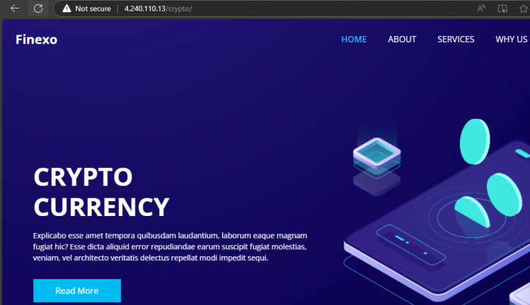

* Manual approach in docker

* Lets pull the nginx image nginx:1.27 and view details

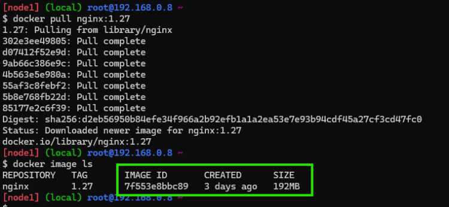

* Now run the container in the detached mode with port exposed

```bash
docker container run -d -P --name crypto-manual nginx:1.27
```

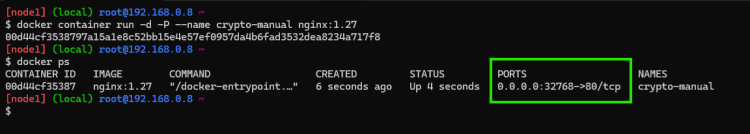

* Download the zip file locally

```bash
cd /tmp && wget https://www.free-css.com/assets/files/free-css-templates/download/page296/finexo.zip
```

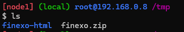

* Now copy the folder into nginx container
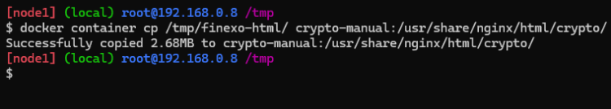
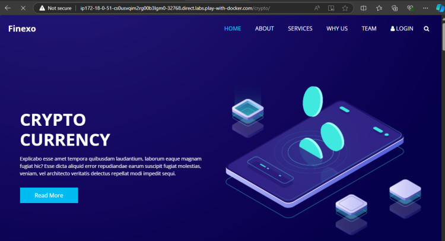

* Now the container crypto-manual has application running inside, we need to create a image of this container
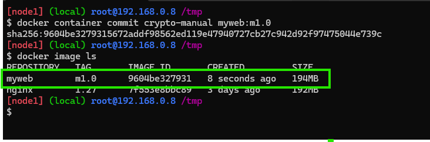

* Now lets create a new container from the image

```bash
docker container run -d --name crypto1 -P myweb:m1.0
```

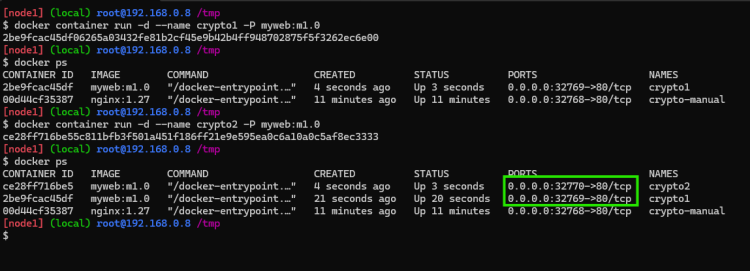


* Dockerfile Approach

* Create a file called as Dockerfile in a folder with following content
  * Dockerfile

```bash  
FROM nginx:1.27
LABEL author='rithwik'
EXPOSE 80
COPY finexo-html/ /usr/share/nginx/html/crypto
```

* Now build the image using command

```bash
docker image build -t myweb:a1.0 .
```


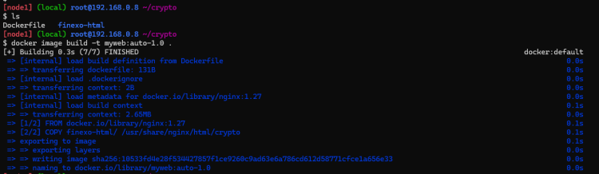

* Now create some containers and cross check
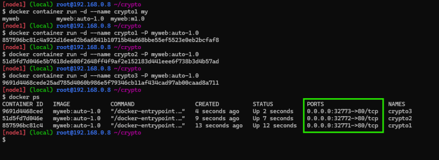
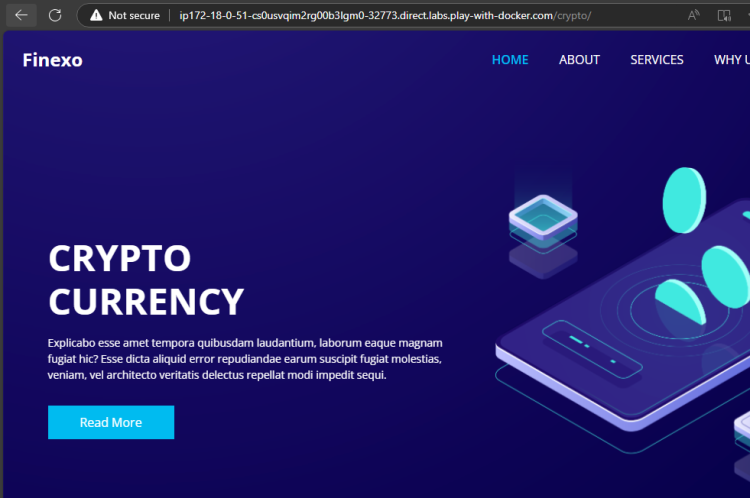

* Dockerfile approach is widely used to create container images as it is repeatable and automatable.

___

## Activity 2: Run a Spring boot application inside container (Containerizing Spring boot application.)

[refer](https://github.com/spring-projects/spring-petclinic) **Download for springpetclinic jar file**

* To run this application we need java 17 jdk
  
```bash
cd /tmp
wget https://github.com/stackify/example-apps/blob/main/sample-java-petclinic/spring-petclinic-2.7.0.jar
```

```bash
java -jar /tmp/spring-petclinic-3.2.0-SNAPSHOT.jar
```

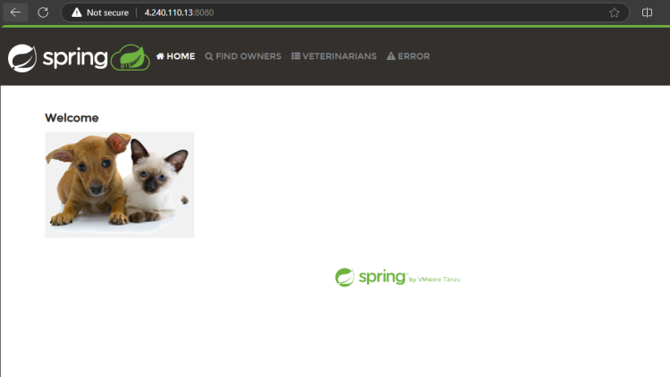

___

## Docker playground approch

```bash
 docker container run -it -p 32000:8080 --name exp1 eclipse-temurin:17-jre /bin/bash
 ```

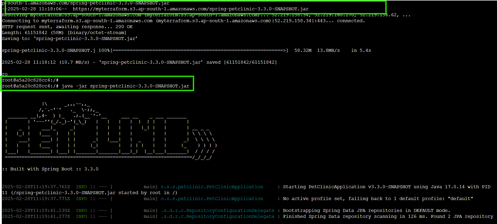

* now you will enter into a docker container now download your jar file 

```bash
wget <your jar file url>
```

* now run the application with below command

```bash
java -jar <your downloaded jar file name >
``` 


* you will see a petclinic logo

**Access the port**

* click on the port
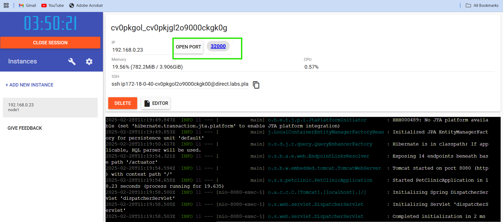
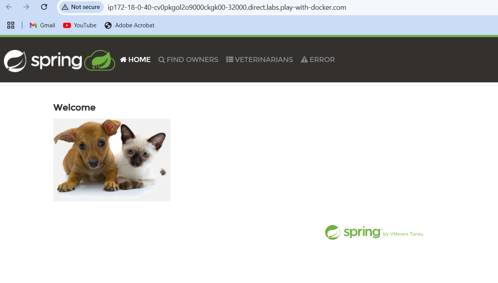
* you can see the spring petclinic web application 

### What is required to run this application

* java 17
* Java comes with two different installations
* JDK: This is required to build and run the java applications
* JRE: This is required to run the java applications

___

## Activity 3: Run a reactjs application

* Sample application [Refer Here](https://github.com/aditya-sridhar/simple-reactjs-app)

* Install nodejs and npm

```bash
curl -fsSL https://deb.nodesource.com/setup_18.x | sudo -E bash -
sudo apt install -y nodejs
```
___
**manual steps**

```bash
git clone https://github.com/aditya-sridhar/simple-reactjs-app.git
```

```bash
cd simple-reactjs-app
npm install
npm run start
```
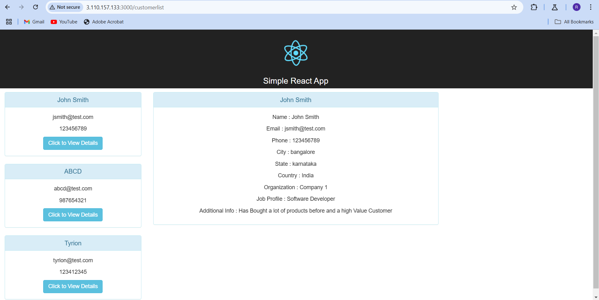

___

**docker playground approch**

```bash
docker container run -it -p 30001:3000 --name react node:18 /bin/bash
```

```bash
git clone https://github.com/aditya-sridhar/simple-reactjs-app.git
npm install
npm run start
```

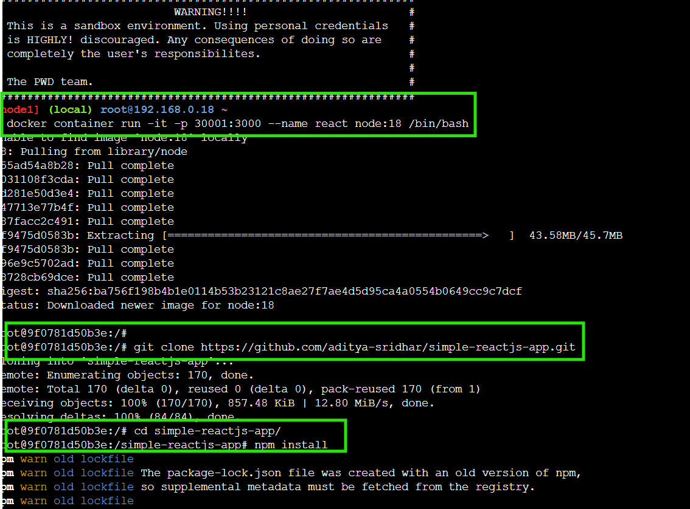

* now click on the port on docker playground after ```npm run start```

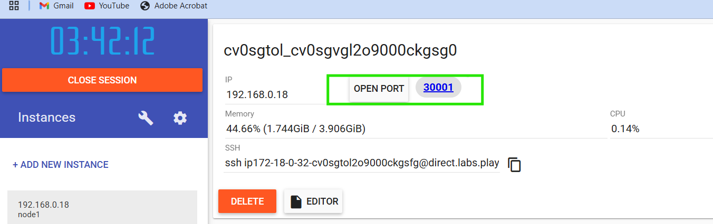
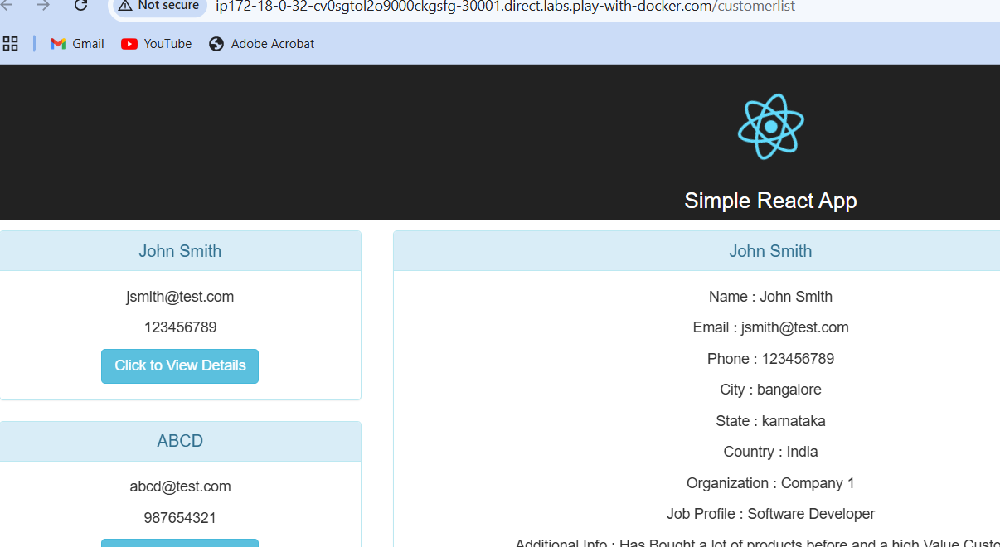

```bash
docker container -it #-it means interative mode which means while running container will go into the container
```
___

**Approach**

  1. Figure out the manual steps on how to deploy your applicaton onto server (os level)

  2. Ensure the dependencies (softwares required to run application)

  3. Now Create a Dockerfile with instructions to containerize your application.
