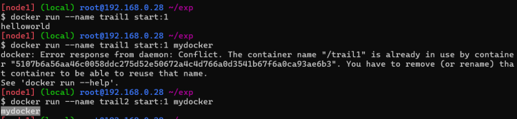

# Dockerfile (Containerization contd…)

* **CMD and ENTRYPOINT**
  * When a  docker container starts it executes
  * Whatever is present in *ENTRYPOINT* and what ever has been written in *CMD* will be arguments to *ENTRYPOINT*

```bash
FROM nginx
ENTRYPOINT ["echo"] # entrypoint is executeable
CMD ["helloworld"] # arguments to entrypoint
```
___

* If **entrypoint** is present but **CMD** is not present in **Dockerfile** then whatever is written in **ENTRYPOINT** will be executed

```bash
FROM nginx
ENTRYPOINT ["echo","helloworld"]
```
___

* IF **ENTRYPOINT** is not found and ony CMD Exists then **CMD** will be executed

```bash
FROM nginx
CMD ["echo","helloworld"]
```
***

* **CMD** can be overriten by passing arguments after image name in docker run command

```bash
docker run --name trail start:1 mydocker  # mydocker is CMD in docker file
```

___

* **ENTRYPOINT** can be overriten by passing a docker command

```bash
docker run --entrypoint 'echo helloworld' --name trail start:1
```



___

* If we donot write **entrypoint** or **CMD** the base images **entrypoint** or **CMD** will be considered
  * Your container will be in running state as long as PID1 **(ENTRYPOINT + CMD)** is running
  * Ideally anything can go in **CMD** or **entrypoint**, But in practice we execute the commands that start our  application and wait till the application is executing.

___

* Typical startup commands
* **java:**
  * spring boot: java -jar < jarfile path>
  * app server: if your app runs on some external server then take the base image of the app server and dont write CMD or ENTRYPOINT
* **react js/angular js/vue js**
  * first option: npm run start or equivalent
  * best option is to create a html site and run in nginx
* **Dotnet (asp.net core)**
  * dotnet < dll path >
* **Python**
  * flask python app.py or server based startup
  * django python app.py or server based startup
  * fastapi uvicorn main:app --host 0.0.0.0 ...

___

## Other instructions

* [Refer Here](https://docs.docker.com/reference/dockerfile/) for official docs for reference
* WORKDIR
* USER

___

### Lets Build a image for Python fastapi

[Refer Here](https://github.com/dummyrepos/Fast-Api-example/tree/main) for the code