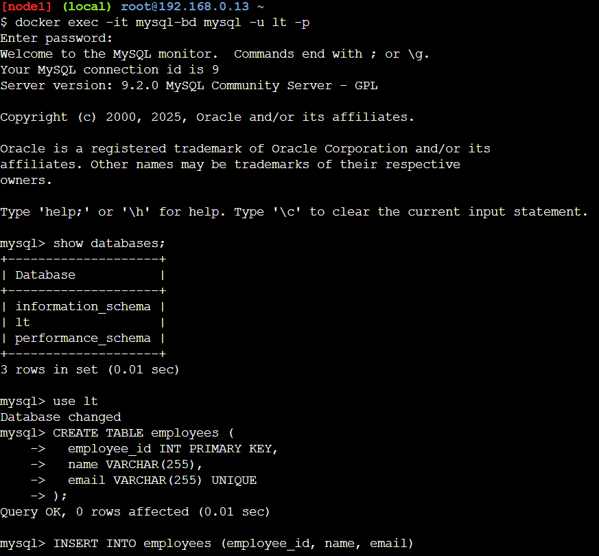

# Docker Images, Containers and volumes

[Refer Here](https://directdevops.blog/2019/09/26/docker-image-creation-and-docker-image-layers/) for article on image layers and [Refer Here](https://directdevops.blog/2019/09/27/impact-of-image-layers-on-docker-containers-storage-drivers/) for impact of image layer and [Refer Here](https://directdevops.blog/2019/10/03/docker-volumes/) for volumes
Dockerfile instruction VOLUME: [Refer Here](https://docs.docker.com/reference/dockerfile/#volume)

## ARG and ENV

* ARG can be used as a parameter while building images [Refer Here](https://docs.docker.com/reference/dockerfile/#arg)
* ENV can be used as a parameter while running containers [Refer Here](https://docs.docker.com/reference/dockerfile/#env)

## .dockerignore

* [Refer Here](https://docs.docker.com/build/concepts/context/#dockerignore-files)

## docker volumes 

```bash
docker volume create < volume name>
```

## Lets run a postgres database inside a container

**Lets create a postgres database with password, user, database and volume mounting**

```bash
docker run --name lib-db -d -e 'POSTGRES_PASSWORD=password' -e 'POSTGRES_USER=lt' \
-e 'POSTGRES_DB=library' -v lib-vol:/var/lib/postgresql/data postgres:17
```

```bash
docker exec -it lib-db psql library -U lt 
```


**Lets create a mysql database with password, user, database and volume mounting**

* lets create a volume

```bash
docker volume create mysql-vol
```


```bash
docker run --name mysql-bd -d -e 'MYSQL_ROOT_PASSWORD=password' -e 'MYSQL_DATABASE=lt' \
-e 'MYSQL_USER=lt' -e 'MYSQL_PASSWORD=ltpassword' -v mysql-vol:/var/lib/mysql  -P mysql:9
```


```bash
docker exec -it mysql-bd mysql -u lt -p
```




* now remove the old container and create a new container with any name and same volume then the data in the old container will be recovered


**Lets create a mongodb database with password, user, database and volume mounting**

* lets create a volume

```bash
docker volume create mongodb
```

```bash
docker run --name mongodb  -d -e 'MONGO_INITDB_ROOT_USERNAME=adminuser' \ 
-e 'MONGO_INITDB_ROOT_PASSWORD=pasword' -v mongodb:/data/db  -P mango 
```

```bash
docker exec -it mongodb mongosh
```

### Exercise

* Run mongodb, mysql and microsoftsqlserver with volumes in a contianer
