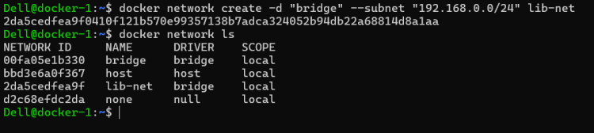
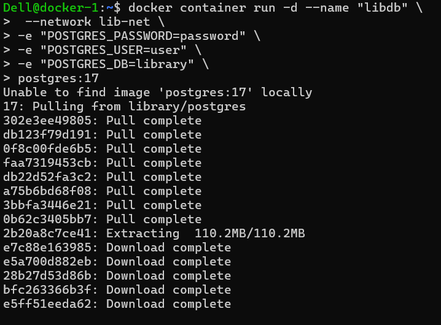
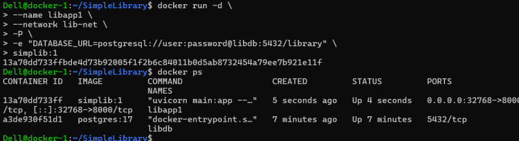
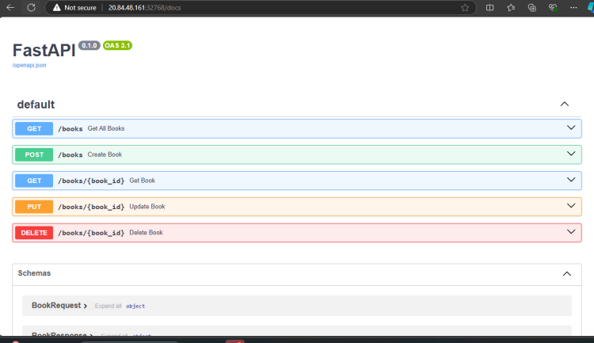

# Connectivity Between Application and Database

## Connection strings

* Every Database generally has a
  * hostname (name/ip address)
  * username
  * password
  * database name (optional)

* Generally all languages use a connection string to establish connection
* When we run our application in containers in most of the cases the  db details are passed as environmental variables and in somecases it will be file

---

## Networking

* Docker supports creating networks of different types
  * bridge network (single host)
  * host network (single host)
  * macvoverlan (single host)
  * overlay (multi host)

* Default bridge network cannot resolve by names but uses only ip, custom bridge networks can resolve with names as well as ips

---

# Running a simple 2 tier application

* Python FastApi and Postgres
[Refer Here](https://github.com/rithwiksrivastav4/SimpleLibrary) for the repo
* Database: postgres
  * Environmental variables
  * POSTGRES_USER=user
  * POSTGRES_PASSWORD=password
  * POSTGRES_DB=library

* Steps:
  * Create a bridge network with a predefined range of ip address 192.168.0.0/24

  * create a postgres container with name libdb with the environmental variables as shown above and attached to the network.

  * Build the image if you donot have it yet from the repo
  * Now run the container in the same network as db with name libapp1, and set DATABASE_URL environmental variable


  * Repeat the above steps by attaching volume for libdb container
  * Use this following dockerfile as reference, to build the docker image of library application

---

```bash
# Stage 1: Build Stage
FROM python:3.11-alpine AS builder

# Set environment variables to avoid Python writing .pyc files and to buffer output
ENV PYTHONDONTWRITEBYTECODE=1
ENV PYTHONUNBUFFERED=1

# Install necessary build dependencies
RUN apk update && apk add --no-cache gcc musl-dev libffi-dev openssl-dev postgresql-dev

# Create a directory for the application
WORKDIR /users

# Copy the requirements file to install dependencies
COPY requirements.txt .

# Install the application dependencies
RUN pip install --no-cache-dir -r requirements.txt

# Stage 2: Runtime Stage
FROM python:3.11-alpine

# Set environment variables to avoid Python writing .pyc files and to buffer output
ENV PYTHONDONTWRITEBYTECODE=1
ENV PYTHONUNBUFFERED=1

# Install runtime dependencies, including PostgreSQL client libraries
RUN apk add --no-cache libpq

# Create a directory for the application
WORKDIR /users

# Copy installed dependencies from the builder stage
COPY --from=builder /usr/local/lib/python3.11/site-packages /usr/local/lib/python3.11/site-packages
COPY --from=builder /usr/local/bin /usr/local/bin

# Copy the application source code to the working directory
COPY . .

# Ensure uvicorn is installed in case it wasn't properly copied or was missed
RUN pip install --no-cache-dir uvicorn

# Expose the port the app runs on
EXPOSE 8000

# Command to run the application
CMD ["uvicorn", "main:app", "--host", "0.0.0.0", "--port", "8000"]
```

---

## Findout What a docker registry is and what is public registry and private registry

* Private registries are used to store images securely and access will be provided within your organization
* Popular private registries
  * Docker hub (Paid Plan)
  * Jfrog
  * Azure Container Registry
  * AWS Elastic Container Registry
* When we create a private registry, we create repository for each image

* Exercise:
  * Build library image usign python:3.11-alpine and push into
  * dockerhub (public)
  * acr
  * ecr
